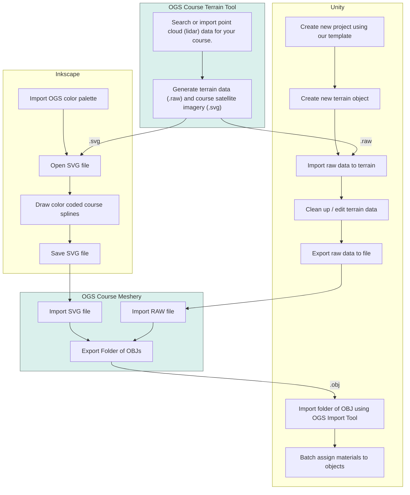

Below is a (very) basic overview of the course building process.

```mermaid
graph TD

subgraph UN1["Unity"]
  UN1_A["Create new project using our template"]
  UN1_B["Create new terrain object"]
  UN1_1["Import raw data to terrain"]
  UN1_2["Clean up / edit terrain data"]
  UN1_3["Export raw data to file"]
  UN1_MSH["Import folder of OBJ using OGS Import Tool"]
  UN1_MSH1["Batch assign materials to objects"]

  UN1_A-->UN1_B
  UN1_B-->UN1_1
  UN1_1-->UN1_2
  UN1_2-->UN1_3

  UN1_MSH-->UN1_MSH1
end
subgraph CTTG["OGS Course Terrain Tool"]
  CTTA["Search or import point cloud (lidar) data for your course."]
  CTTB["Generate terrain data (.raw) and course satellite imagery (.svg)"]
  CTTA-->CTTB
end

subgraph INK["Inkscape"]
  IKA["Import OGS color palette"]
  IKB["Open SVG file"]
  IKC["Draw color coded course splines"]
  IKD["Save SVG file"]
  IKA-->IKB
  IKB-->IKC
  IKC-->IKD
end

subgraph MSH["OGS Course Meshery"]
  MSH_A["Import SVG file"]
  MSH_B["Import RAW file"]
  MSH_C["Export Folder of OBJs"]
  MSH_A-->MSH_C
  MSH_B-->MSH_C
end

CTTB--.raw-->UN1_1
CTTB--.svg-->IKB
IKD-->MSH_A
UN1_3-->MSH_B
MSH_C--.obj-->UN1_MSH

style CTTG fill:#daf0ec,stroke:#697875,stroke-width:1px
style MSH fill:#daf0ec,stroke:#697875,stroke-width:1px


```
